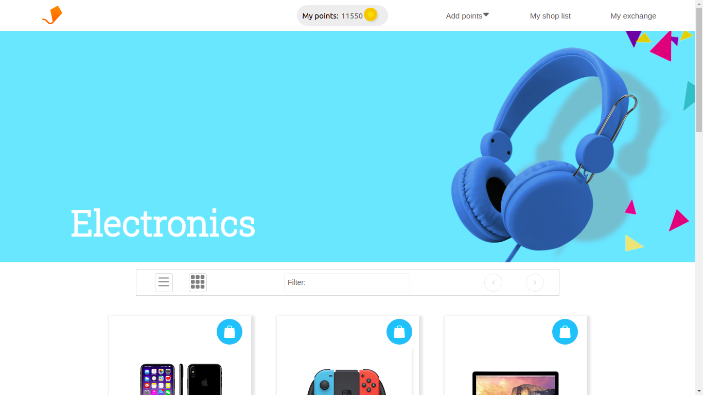
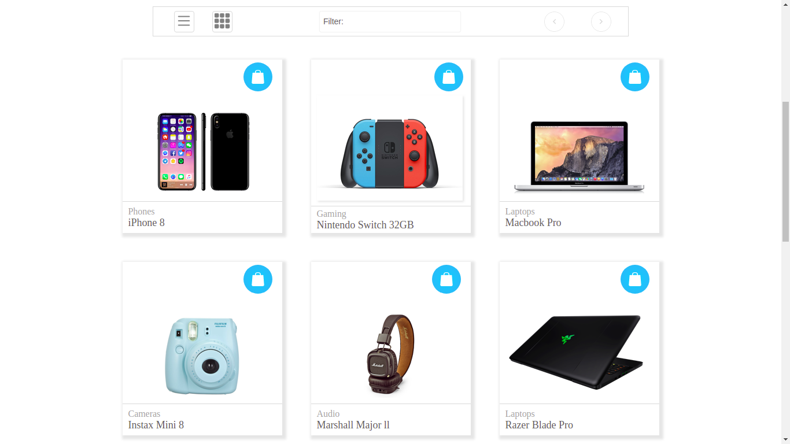
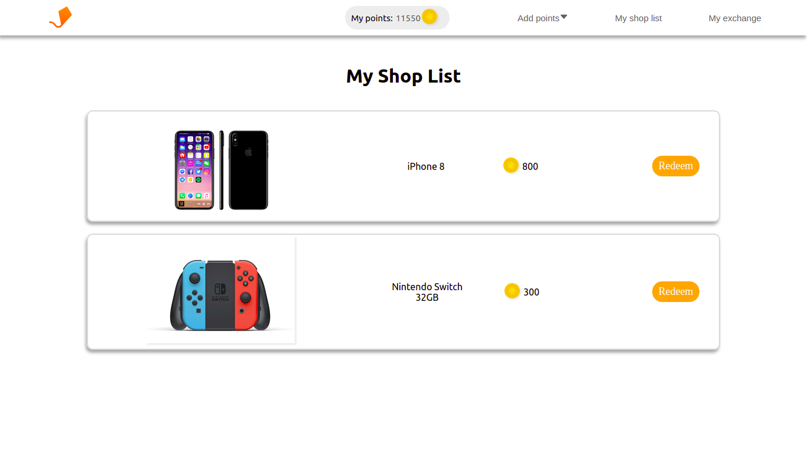
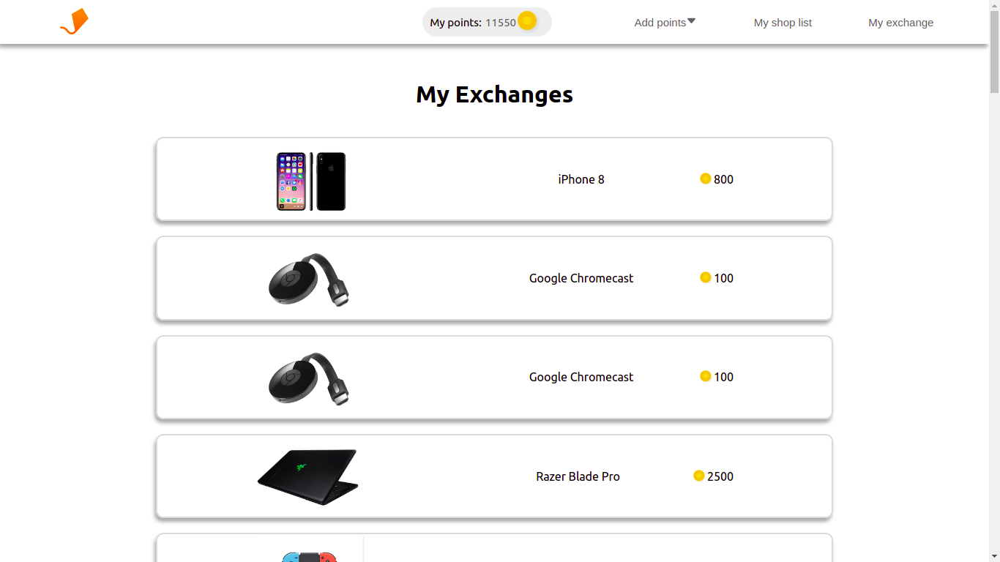
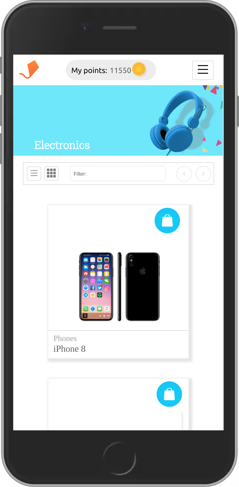
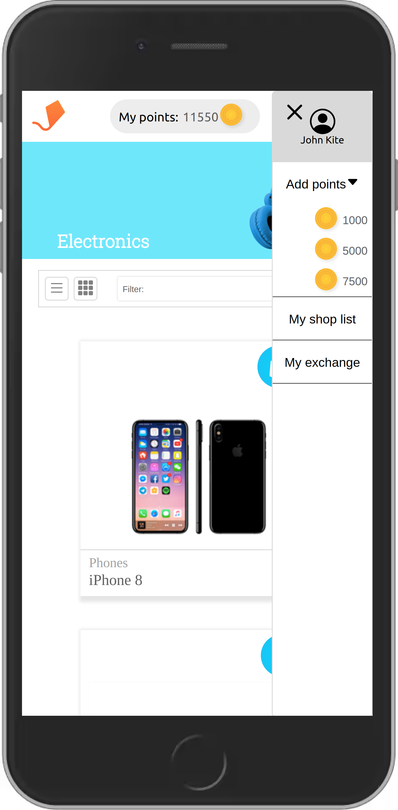
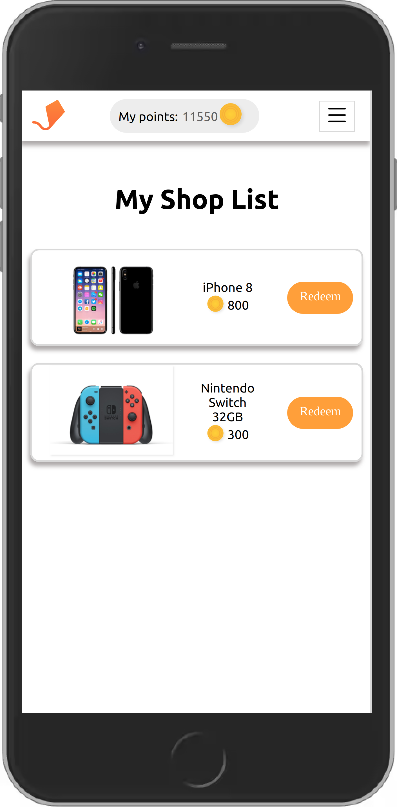
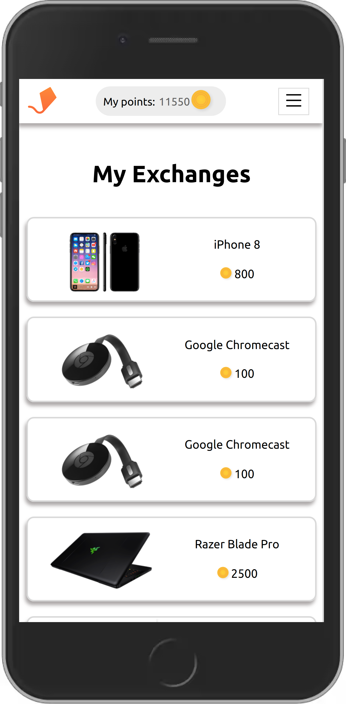

# Aerolab Coding Challenge

## Summary

 This project belongs to the Aerolab Coding Challenge.
Create a front end side of an application that allows the user redeem points for electronics products.  

## Demo

[https://maurorojas-aerolab-coding-challenge.netlify.app](https://maurorojas-aerolab-coding-challenge.netlify.app/)

## Installation

To install and run this proyect just type and execute

```bash
npm install
```

And then:

```bash
#Option 1
npm start

#Option 2
npm run start
```

## Dependencies

1. `react-router-dom v^1.5.0`
2. `react-bootstrap-icons v^5.3.0`
3. `sweetalert2 "v11.1.9`
4. `sweetalert2-react-content v^4.2.0`

## Preview
 | 
:-------------------------:|:-------------------------:
  |  
---
 | 
:-------------------------:|:-------------------------:
  |  